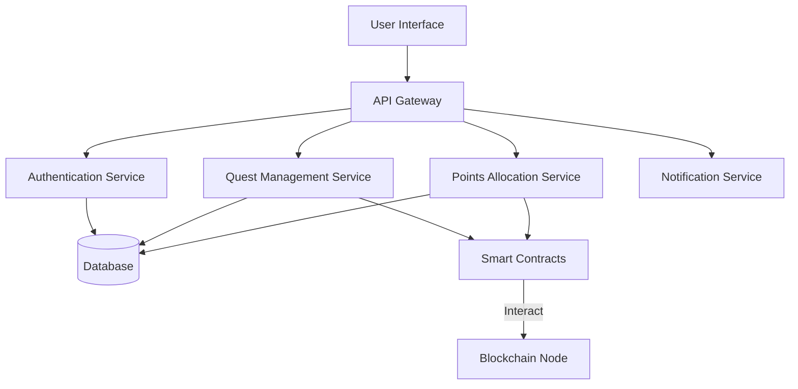

import { Callout } from 'nextra/components';
import { Tabs, Tab } from 'nextra/components';
import { Cards, Card } from 'nextra/components';

# Technical Architecture of the GOAT Founders Club Ecosystem

<Callout type="info">
  Dive deep into the technical infrastructure powering the GOAT Founders Club platform.
</Callout>

## System Overview

The GOAT Founders Club Ecosystem is designed to foster blockchain innovation by providing founders with a platform to create engaging quests, allocate points, and reward user participation. The system combines blockchain technology with traditional web development practices to offer a secure, scalable, and user-friendly platform.

### Core Components

- **User Interface (UI):** Web and mobile applications where users and founders interact with the platform.
- **API Gateway:** A centralized point that handles all incoming API requests and routes them to the appropriate microservices.
- **Microservices:**
  - **Authentication Service:** Manages user authentication and authorization.
  - **Quest Management Service:** Handles creation, updating, and tracking of quests.
  - **Points Allocation Service:** Manages the allocation and redemption of points.
- **Smart Contracts:** Deployed on the GOAT Network to ensure transparency and security of on-chain transactions.
- **Blockchain Node:** Interacts with the GOAT Network blockchain for reading and writing data.
- **Database:** Stores user data, quest details, and other essential information.
- **Notification Service:** Sends real-time notifications to users.

## Technical Components

### System Architecture Diagram



### Authentication and Security

<Tabs items={['User Authentication', 'Smart Contract Security', 'Data Protection']}>
  <Tab>
    #### User Authentication

    - **Implementation Details:**
      - **Password Hashing:** Use bcrypt or Argon2.
      - **JWT Tokens:** For session management.
      - **Two-Factor Authentication (2FA):** Optional for enhanced security.

    - **Example Code:**
      ```javascript
      // Node.js Express authentication middleware
      const jwt = require('jsonwebtoken');

      function authenticateToken(req, res, next) {
        const token = req.headers['authorization'];
        if (!token) return res.sendStatus(401);

        jwt.verify(token, process.env.ACCESS_TOKEN_SECRET, (err, user) => {
          if (err) return res.sendStatus(403);
          req.user = user;
          next();
        });
      }
      ```
  </Tab>

  <Tab>
    #### Smart Contract Security

    - **Best Practices:**
      - **Use OpenZeppelin Contracts:** Leverage audited libraries.
      - **Access Control:** Implement role-based permissions.
      - **Safe Math Operations:** Use Solidity's built-in overflow checks.

    - **Example Code:**
      ```solidity
      // SPDX-License-Identifier: MIT
      pragma solidity ^0.8.0;

      import "@openzeppelin/contracts/access/Ownable.sol";

      contract QuestManager is Ownable {
          struct Quest {
              uint256 id;
              string title;
              string description;
              uint256 rewardPoints;
              bool isActive;
          }

          mapping(uint256 => Quest) public quests;
          uint256 public nextQuestId;

          function createQuest(string memory _title, string memory _description, uint256 _rewardPoints) external onlyOwner {
              quests[nextQuestId] = Quest(nextQuestId, _title, _description, _rewardPoints, true);
              nextQuestId++;
          }
      }
      ```
  </Tab>

  <Tab>
    #### Data Protection

    - **Encryption:** Use TLS/SSL for data in transit.
    - **Data Minimization:** Only store essential user data.
    - **Regular Audits:** Conduct security audits and penetration testing.

    - **Example Configuration:**
      ```yaml
      # Example of enabling SSL in Nginx
      server {
          listen 443 ssl;
          server_name example.com;

          ssl_certificate /etc/ssl/certs/ssl-cert.crt;
          ssl_certificate_key /etc/ssl/private/ssl-cert.key;

          ...
      }
      ```
  </Tab>
</Tabs>

### Quest Management Service

<Callout type="default">
  Handles creation, tracking, and completion of founder quests
</Callout>

```rust
struct Quest {
    id: Uuid,
    founder_id: Uuid,
    quest_type: QuestType,
    points_allocation: u64,
    start_time: Timestamp,
    end_time: Timestamp,
    current_participants: u64,
    status: QuestStatus
}

enum QuestType {
    DAU,
    TRX,
    TVL
}

impl QuestService {
    fn create_quest(
        founder_id: Uuid, 
        quest_type: QuestType, 
        points: u64
    ) -> Result<Quest, QuestCreationError> {
        // Validate founder
        // Create quest in database
        // Emit quest creation event
    }

    fn complete_quest(
        quest_id: Uuid, 
        user_id: Uuid
    ) -> Result<(), QuestCompletionError> {
        // Validate quest and user
        // Update quest participation
        // Allocate points to user
    }
}
```

### Points System Implementation

The points system in the FoundersClub smart contract is central to incentivizing and rewarding founders and participants. Below is an overview of how points are allocated, distributed, and converted within the system.

#### Overview of the Points System

In the FoundersClub smart contract, points serve as a mechanism to allocate rewards to founders and their associated contracts. Here's how it works:

**1. Allocation of Points to Founders**

- **Function:** `allocatePointsToFounder(address founderAddress, uint256 points)`
- **Process:** The contract owner allocates points to a founder, increasing their `allocatedPoints`.
- **Constraints:** Only callable by the contract owner. The founder must be active.
- **Event Emitted:** `PointsAllocated(address indexed founder, uint256 amount)`

**2. Distribution of Points to Contracts**

- **Function:** `distributePointsToContract(address founderAddress, address contractAddress, uint256 points)`
- **Process:** Founders distribute points from their allocated balance to their registered contracts.
- **Constraints:** Only callable by the contract owner. The founder must have sufficient available points.
- **Event Emitted:** `PointsDistributed(address indexed founder, address indexed contractAddress, uint256 amount)`

**3. Conversion of Points to Rewards**

- **Function:** `convertPointsToRewards(address founderAddress, address contractAddress, uint256 pointsToConvert)`
- **Process:** Contracts convert `currentPoints` into `pendingRewards` at a defined conversion rate.
- **Constraints:** Only callable by the contract owner. The contract must have enough `currentPoints`.
- **Event Emitted:** `PointsConverted(address indexed contractAddress, uint256 pointsConverted, uint256 rewardsGenerated)`

**4. Claiming Rewards**

- **Function:** `claimRewards(address founderAddress, address contractAddress)`
- **Process:** Founders claim `pendingRewards` from their contracts, moving them to `earnedRewards`.
- **Constraints:** Only callable by the contract owner. The contract must have `pendingRewards` greater than zero.
- **Event Emitted:** `RewardsClaimed(address indexed founder, address indexed contractAddress, uint256 amount)`

#### Data Structures Involved

**Founder Struct**

```solidity
struct Founder {
    address[] contracts;
    uint256 allocatedPoints;
    uint256 distributedPoints;
    uint256 earnedRewards;
    bool isActive;
    string founderName;
}
```

**ContractInfo Struct**

```solidity
struct ContractInfo {
    string name;
    address contractAddress;
    uint256 currentPoints;
    uint256 pendingRewards;
    uint256 claimedRewards;
    string category;
    bool isVerified;
}
```

#### Workflow of Points Through the System

1. **Admin Allocates Points to Founder**
   - Points are added to `founder.allocatedPoints`.
2. **Founder Distributes Points to Contracts**
   - Points move from `allocatedPoints` to `distributedPoints`.
   - Contracts receive points in `currentPoints`.
3. **Contracts Hold Current Points**
   - `currentPoints` can be converted to rewards.
4. **Conversion of Points to Rewards**
   - `currentPoints` decrease.
   - `pendingRewards` increase based on the conversion rate (e.g., 100 points = 1 reward).
5. **Claiming Rewards**
   - Founders claim rewards, increasing `earnedRewards`.
   - `pendingRewards` reset to zero.

#### Example Scenario

- **Allocation:** Admin allocates 1,000 points to Founder Alice.
- **Distribution:** Alice distributes 500 points to Contract X.
- **Conversion:** Contract X converts 300 points to rewards.
- **Claiming:** Alice claims rewards from Contract X.

#### Visual Representation

```
Admin
  │
  └─ Allocates Points to Founder (allocatedPoints)
       │
       └─ Founder Distributes Points to Contracts (currentPoints)
            │
            └─ Contracts Hold Points (currentPoints)
                 │
                 └─ Points Converted to Rewards (pendingRewards)
                      │
                      └─ Founder Claims Rewards (earnedRewards)
```

## Infrastructure Considerations

### Deployment Architecture

- Containerized microservices
- Kubernetes orchestration
- Multi-region redundancy
- Automated scaling

### Monitoring and Observability

- Distributed tracing
- Performance metrics
- Error tracking
- Real-time alerting

<Callout type="success">
  A robust, scalable, and secure platform for blockchain innovation!
</Callout>

## Key Technical Principles

1. Decentralization
2. Transparency
3. Security
4. Scalability
5. Performance

## Security and Validation Measures

- **Access Control Modifiers:**
  - `onlyOwner`: Ensures only the contract owner can call certain functions.
  - `whenNotPaused`: Ensures functions are callable when the contract is not paused.
- **Ownership Validation:**
  - Validates that contracts are registered under the correct founder.
- **Error Handling:**
  - Custom errors provide specific failure messages and save gas.
- **Event Emissions:**
  - Critical functions emit events for transparency and off-chain tracking.

## Resources

- **Developer Tools:**
  - [dRPC](https://drpc.org/chainlist/goat)
  - [DIA Oracles](https://www.diadata.org/blog/post/goat-network-dia-oracles-price-feeds/)
  - [APRO](https://docs.apro.com/en)
  - [LayerZero](https://docs.layerzero.network/v2/developers/evm/technical-reference/deployed-contracts#goat-testnet)
  - [Hardhat](https://hardhat.org/)
  - [OpenZeppelin Contracts](https://openzeppelin.com/contracts/)

- **Documentation:**
  - [Technical Whitepaper](https://drive.google.com/file/d/1U-thxS4DRfSTOsLxC2ezQNk1KNrrLBd3/view)
  - [Founders Club Master Document](https://docs.google.com/document/d/1WQfICLXi44a1Sckpicbult13mDuwl3rWmrT4rsjKFjM/edit)
  - [Founders Club Article (Contextual Overview)](https://docs.google.com/document/d/1ZeNBUeGoBsfAjBaURVbmnbj5hmgaDUF7MmiHeTJVXOY/edit)

- **Community:**
  - [Discord Community](https://discord.gg/99WEU3Y4)
  - [Developer Telegram](https://t.me/+5JwHzveSo4IxMGY5)

<Callout type="success">
  Join us in revolutionizing blockchain innovation with the GOAT Founders Club! Contribute, collaborate, and create impactful projects.
</Callout>

## Next Steps

Ready to learn how to participate?

[Explore Participation Guide →](/founders/fc-participation)