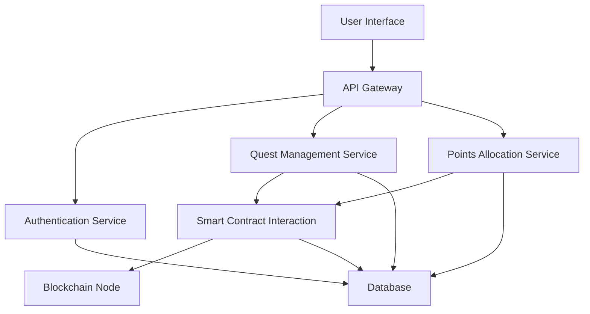

import { Callout } from 'nextra/components'
import { Tabs, Tab } from 'nextra/components'
import { Cards, Card } from 'nextra/components'

# Technical Architecture of the Founders Club Ecosystem

<Callout type="info">
  A deep dive into the technical infrastructure powering the GOAT Founders Club platform
</Callout>

## System Overview

### Core Architecture

## Technical Components

### System Architecture Diagram



### Authentication and Security

<Tabs items={['User Authentication', 'Smart Contract Security', 'Data Protection']}>
  <Tab>
    ```rust
    // Example Rust authentication flow
    fn authenticate_user(credentials: UserCredentials) -> Result<Token, AuthError> {
        let user = find_user_by_email(&credentials.email)?;
        
        if verify_password(&user.hashed_password, &credentials.password) {
            let token = generate_jwt_token(user.id);
            Ok(token)
        } else {
            Err(AuthError::InvalidCredentials)
        }
    }
    ```
  </Tab>
  <Tab>
    ```solidity
    // Smart Contract Access Control
    function onlyFounder() internal view {
        require(
            founderRegistry[msg.sender] == true,
            "Only registered founders can access"
        );
    }
    
    function createQuest(QuestParams memory params) external {
        onlyFounder();
        // Quest creation logic
    }
    ```
  </Tab>
  <Tab>
    ```rust
    // Data encryption middleware
    fn encrypt_sensitive_data(data: &str) -> String {
        let key = get_encryption_key();
        let encrypted = aes_encrypt(data, key);
        base64_encode(encrypted)
    }
    
    fn decrypt_sensitive_data(encrypted: &str) -> String {
        let key = get_encryption_key();
        let decoded = base64_decode(encrypted);
        aes_decrypt(decoded, key)
    }
    ```
  </Tab>
</Tabs>

### Quest Management Service

<Callout type="default">
  Handles creation, tracking, and completion of founder quests
</Callout>

```rust
struct Quest {
    id: Uuid,
    founder_id: Uuid,
    quest_type: QuestType,
    points_allocation: u64,
    start_time: Timestamp,
    end_time: Timestamp,
    current_participants: u64,
    status: QuestStatus
}

enum QuestType {
    DAU,
    TRX,
    TVL
}

impl QuestService {
    fn create_quest(
        founder_id: Uuid, 
        quest_type: QuestType, 
        points: u64
    ) -> Result<Quest, QuestCreationError> {
        // Validate founder
        // Create quest in database
        // Emit quest creation event
    }

    fn complete_quest(
        quest_id: Uuid, 
        user_id: Uuid
    ) -> Result<Points, QuestCompletionError> {
        // Validate quest completion
        // Allocate points
        // Update quest participation
    }
}
```

### Points Allocation Mechanism

<Callout type="warning">
  Transparent and fair points distribution using blockchain technology
</Callout>

```solidity
contract PointsAllocation {
    mapping(address => uint256) public founderPoints;
    mapping(address => uint256) public userPoints;

    function allocateFounderPoints(
        address founder, 
        uint256 points
    ) external onlyAdmin {
        founderPoints[founder] += points;
    }

    function distributePoints(
        address user, 
        uint256 questPoints
    ) external onlyQuestService {
        userPoints[user] += questPoints;
        emit PointsDistributed(user, questPoints);
    }
}
```

### API Design

<Tabs items={['GraphQL Schema', 'REST Endpoints', 'WebSocket Events']}>
  <Tab>
    ```graphql
    type Quest {
      id: ID!
      type: QuestType!
      points: Int!
      startTime: DateTime!
      endTime: DateTime!
    }

    type Mutation {
      createQuest(input: QuestInput!): Quest
      completeQuest(questId: ID!): Points
    }
    ```
  </Tab>
  <Tab>
    ```rust
    // REST API Endpoints
    #[get("/quests")]
    fn list_active_quests() -> Json<Vec<Quest>> {
        // Retrieve active quests
    }

    #[post("/quests/{id}/complete")]
    fn complete_quest(quest_id: Uuid) -> HttpResponse {
        // Quest completion logic
    }
    ```
  </Tab>
  <Tab>
    ```typescript
    // WebSocket Event Handlers
    socket.on('quest:created', (quest) => {
      updateQuestList(quest);
      notifyFounders(quest);
    });

    socket.on('quest:completed', (completion) => {
      updateUserPoints(completion);
      triggerRewardMechanism(completion);
    });
    ```
  </Tab>
</Tabs>

## Infrastructure Considerations

### Deployment Architecture

- Containerized microservices
- Kubernetes orchestration
- Multi-region redundancy
- Automated scaling

### Monitoring and Observability

- Distributed tracing
- Performance metrics
- Error tracking
- Real-time alerting

<Callout type="success">
  A robust, scalable, and secure platform for blockchain innovation!
</Callout>

## Key Technical Principles

1. Decentralization
2. Transparency
3. Security
4. Scalability
5. Performance

## Resources

- [Technical Whitepaper](https://founders.goat.network/)
- [Developer Documentation](https://founders.goat.network/)
- [GitHub Repository](https://founders.goat.network/)

## Next Steps

Ready to learn how to participate?

[Explore Participation Guide →](/founders/fc-participation)